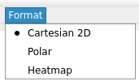
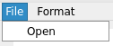

# Usage

まず、左上の`Format`から表示形式を選択する。
デフォルトでは`Cartesian2D`(直交座標)になっている。

左上の`File`をクリックし`Open`からプロットするデータが入ったファイルを選択する

## Sパラメータ(直交座標)
正しくファイルが読み込めると右側でプロットする系列を選択することができる。

x軸はプルダウンから選択し、y軸は複数選択することができる。
下側のプルダウンからy軸に追加する系列を選び`Add`をクリックで追加できる。
`Clear`でy軸に追加した系列をリセットする。

右下の`Apply`で上記の設定を反映する。

図に関する設定は  をクリックすることで設定できる。

図の保存は  をクリックすることでできる。

## 放射パターン

## 電磁界分布

## 電磁界分布アニメーション(開発途中)
