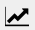
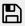

# Usage

まず、左上の`Format`から表示形式を選択する。
デフォルトでは`Cartesian2D`(直交座標)になっている。

左上の`File`をクリックし`Open`からプロットするデータが入ったファイルを選択する

## Sパラメータ(直交座標)
正しくファイルが読み込めると右側でプロットする系列を選択することができる。

x軸はプルダウンから選択し、y軸は複数選択することができる。
下側のプルダウンからy軸に追加する系列を選び`Add`をクリックで追加できる。
`Clear`でy軸に追加した系列をリセットする。

右下の`Apply`で上記の設定を反映する。

図に関する設定は  をクリックすることで設定できる。

図の保存は  をクリックすることでできる。

## 放射パターン

左上の`Format`で`Polar`を選択する。
あとはSパラメータ(直交座標)と同様

## 分散曲線
左上の`File`から回路全体のtouch stoneファイルを読み込む。

`dispersion`タブを開き`Open Port Data`をクリックしポートのみのtouch stoneファイルを開く

単位セル数, ~~ 単位セル長さ ~~ , 位相の不定性の補正m (整数), プロットの範囲を設定する。

## 電磁界分布
`Format` > `Heatmap` を選択し、`3D`タブを開く。

3次元データを表示するため、どの軸で断面図を生成するか選択する必要がある。
`cutting plane` が `xy`で`coordinate`が 0 の時は z=0の断面図を表示する。

`Freq`で周波数を選択する。

`Offset`,`Max`,`Min`はオフセット(すべての値に足される),最大値,最小値である。
後述のアニメーションを使う場合は、`Max`と`Min`を設定しないと各画像でカラースケールが異なるため、滑らかに再生することができないので注意。

`Animation`の`enable`にチェックマークを付けると、アニメーションで表示することができる。

アニメーションを使うときは左上からLinearMagnitudeのデータを読み込み、
`Open Phase Data`から位相(degree)のデータを読み込む。

`step num`で360を何等分するかを、`interval[ms]`でGIFの画像の時間間隔を設定する。

`Save as GIF`で表示しているアニメーションをGIF形式で保存することができる。

